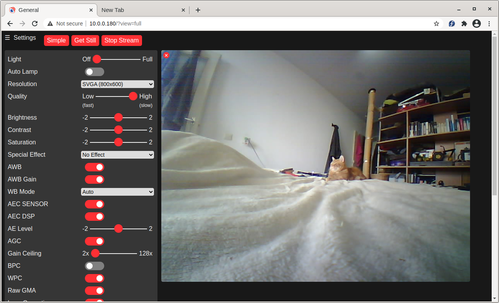
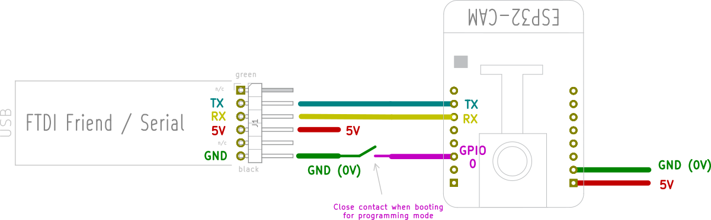
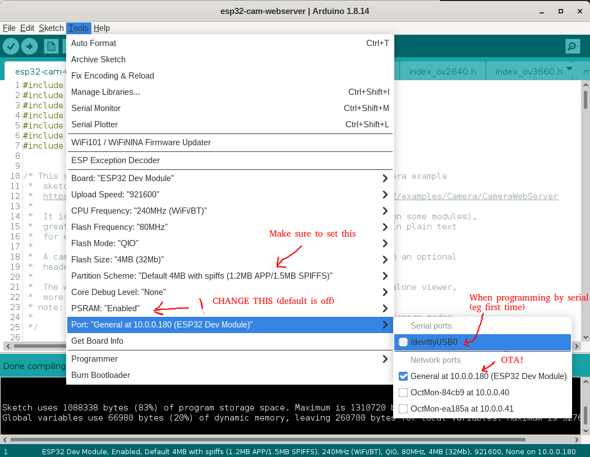
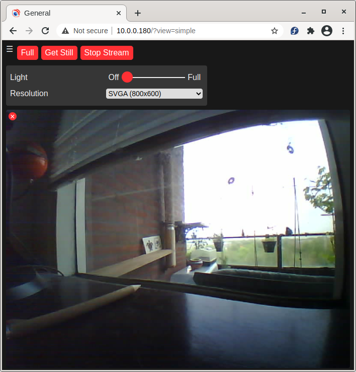
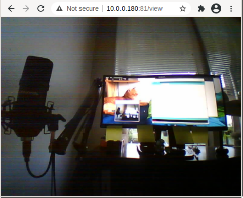
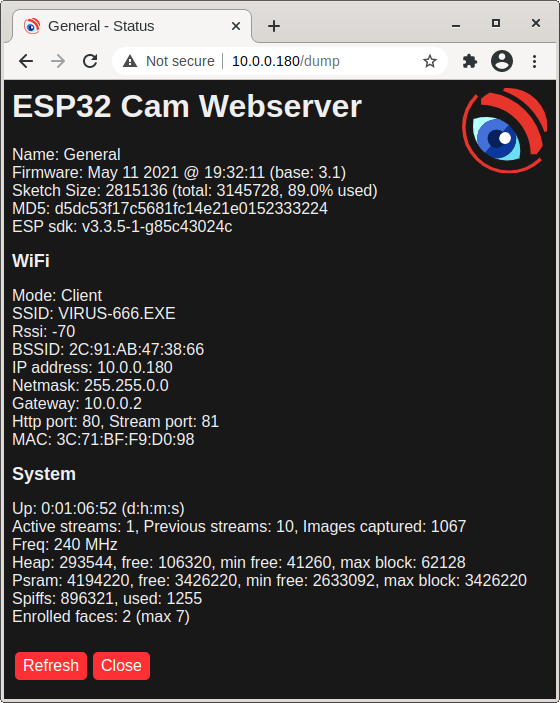

# ESP32-CAM example revisited. &nbsp;&nbsp;&nbsp;  &nbsp;&nbsp; 

## Taken from the ESP examples, and expanded
This sketch is a extension/expansion/rework of the 'official' ESP32 Camera example sketch from Espressif:

https://github.com/espressif/arduino-esp32/tree/master/libraries/ESP32/examples/Camera/CameraWebServer

But expanded with:
* More options for default network and camera settings
* Save and restore settings
* Control of on-board lamps, rotate the view in the browser
* Dedicated standalone stream viewer
* Over The Air firmware updates
* Lots of minor fixes and tweaks, documentation etc.

And 'reduced' by removing the Face Recognition features
* **If you want to try the Face Recognition features** please use the [`3.x` maintenance branch](https://github.com/easytarget/esp32-cam-webserver/tree/3.x), which still recieves bugfixes, but is not receiving any further development.
* They were a demo, only worked in low resolution modes, did not preserve the face database between power cycles, and were of little use in real-world applications.
* There are other (specialised) sketches for the ESP-CAM that do use face recognitioni more effectively, if this is your thing :-)

The original example is a bit incomprehensible and hard to modify as supplied. It is very focused on showing off the face recognition capabilities, and forgets the 'webcam' part.
* There are many other variants of a webcam server for these modules online, but most are created for a specific scenario and not good for general, casual, webcam use.

Hopefully this expanded example is more useful for those users who wish to set up a simple ESP32 based webcam using the cheap(ish) modules freely available online. Especially the AI-THINKER board:

#### AI-THINKER ESP32-CAM vs Other Modules:

I have four [AI-THINKER ESP32-CAM](https://github.com/raphaelbs/esp32-cam-ai-thinker/blob/master/assets/ESP32-CAM_Product_Specification.pdf) boards, so the descriptions below are for that board. But I took care to leave the default definitions and controls for other boards in the example intact. You may need to adjust the programming method to suit the your board, look for examples online.

* For some other good examples and information on ESP32 based webcams I also recommend the sketches here:
https://github.com/raphaelbs/esp32-cam-ai-thinker
* The AI thinker wiki can be quite informative, when run through an online translator and read sensibly:
https://wiki.ai-thinker.com/esp32-cam
* Default pinouts are also included for WRover Kit, ESP Eye and M5Stack esp32 camera modules.
  I do not have any of these boards, so they are untested by me. Please [let me know](https://github.com/easytarget/esp32-cam-webserver/issues) if you find issues or have a board not [in the list](./camera_pins.h).

## Troubleshooting:

A lot of common issues with this sketch are discussed and covered in the discussion forums:

https://github.com/easytarget/esp32-cam-webserver/discussions/categories/common-issues

The existing [issues list](https://github.com/easytarget/esp32-cam-webserver/issues?q=is%3Aissue) on Github is a good place to start if you have a specific issue not covered above or in the forums.

There is also this excellent guide for help with some common issues seen with the camera modules:
https://randomnerdtutorials.com/esp32-cam-troubleshooting-guide/

### Known Issues

Builds made with PlatformIO are currently (v4.0) broken; the stream will die shortly after starting. See https://github.com/easytarget/esp32-cam-webserver/issues/218 for more info.

The ESP32 itself is susceptible to the usual list of WiFi problems, not helped by having small antennas, older designs, congested airwaves and demanding users. The majority of disconnects, stutters and other comms problems are simply due to 'WiFi issues'. The AI-THINKER camera module & esp32 combination is quite susceptible to power supply problems affecting both WiFi conctivity and Video quality; short cabling and decent power supplies are your friend here; also well cooled cases and, if you have the time, decoupling capacitors on the power lines.

A basic limitation of the sketch is that it can can only support one stream at a time. If you try to connect to a cam that is already streaming (or attempting to stream) you will get no response and, eventually, a timeout. The stream itself is a [MJPEG stream](https://en.wikipedia.org/wiki/Motion_JPEG), which relies on the client (the web browser) to hold the connection open and request each new frame in turn via javascript. This can cause errors when browsers run into Javascript or caching problem, fail to request new frames or refuse to close the connection.
* If you cannot start the stream you can check the `/dump` page of the cam to see if it currently reports the camera as streaming or not.

Note that I do not respond to any Private Messages (via github, hackaday, or wherever) for support.

## Setup:

* For programming you will need a suitable development environment, I use the Arduino IDE, but this code should work in the Espressif development environment too.
* Make sure you are using the [latest version](https://www.arduino.cc/en/main/software#download) of the IDE and then follow [This Guide](https://docs.espressif.com/projects/arduino-esp32/en/latest/installing.html) to set up the Espressif Arduino core for the IDE.
* _I do not recommend or support running with development builds of either the IDE or the ESP arduino core._
* If you have a development board (anything that can be programmed via a standard USB cable/jack on the board itself) you are in luck. Just plug it in and skip ahead to the [config](#config) section. Remember to set your board model.
* The AI-THINKER board requires use of an external **3.3v** serial adapter to program; I use a `FTDI Friend` adapter, for more about this read AdaFruits excellent [FTDI Friend guide](https://learn.adafruit.com/ftdi-friend).
* Be careful not to use a 5v serial adapter since this will damage the ESP32.

### Wiring for AI-THINKER Boards (and similar clone-alikes)

Is pretty simple, You just need jumper wires, no soldering really required, see the diagram below.

* Connect the **RX** line from the serial adapter to the **TX** pin on ESP32
* The adapters **TX** line goes to the ESP32 **RX** pin
* The **GPIO0** pin of the ESP32 must be held LOW (to ground) when the unit is powered up to allow it to enter it's programming mode. This can be done with simple jumper cable connected at poweron, fitting a switch for this is useful if you will be reprogramming a lot.
* You must supply 5v to the ESP32 in order to power it during programming, the FTDI board can supply this.

### Download the Sketch, Unpack and Rename
Download the latest release of the sketch from https://github.com/easytarget/esp32-cam-webserver/releases/latest
- You can get the latest stable development release by cloning / downloading the `master` branch of the repo.

This will give you an archive file with the Version number in it, eg.`esp32-cam-webserver-4.0.zip`. You need to unpack this into your Arduino sketch folder, and then you need to **rename the folder you extracted to remove the version number**, eg.`esp32-cam-webserver-4.0` becomes `esp32-cam-webserver`.

Once you have done that you can open the sketch in the IDE by going to the `esp32-cam-webserver` sketch folder and selecting `esp32-cam-webserver.ino`.

### Config

By default the sketch assumes you have an AI-THINKER board, it creates an AccessPoint called `ESP32-CAM-CONNECT` and with the password `InsecurePassword`; connect to that and then browse to [`http://192.168.4.1/`](http://192.168.4.1/). This is nice and easy for testing and demo purposes.

To make a permanent config with your home wifi settings, different defaults or a different board; copy (or rename) the file `myconfig.sample.h` in the sketch folder to `myconfig.h` and edit that, all the usable defaults are in that file. Because this is your private copy of the config it will not get overwritten if you update the main sketch!

### Programming

Assuming you are using the latest Espressif Arduino core the `ESP32 Dev Module` board will appear in the ESP32 Arduino section of the boards list. Select this (do not use the `AI-THINKER` entry listed in the boiards menu, it is not OTA compatible, and will caus the module to crash and reboot rather than updating if you use it.

Make sure you select the `Minimal SPIFFS (1.9MB APP with OTA/190KB SPIFFS)` partition scheme and turn `PSRAM` on.

The first time you program (or if OTA is failing) you need to compile and upload the code from the IDE, and when the `Connecting...` appears in the console reboot the ESP32 module while keeping **GPIO0** grounded. You can release GPO0 once the sketch is uploading, most boards have a 'boot' button to trigger a reboot.

Once the upload completes (be patient, it can be a bit slow) open the serial monitor in the IDE and reboot the board again without GPIO0 grounded. In the serial monitor you should see the board start, connect to the wifi and then report the IP address it has been assigned.

Once you have the initial upload done and the board is connected to the wifi network you should see it appearing in the `network ports` list of the IDE, and you can upload wirelessly.

If you have a status LED configured it will give a double flash when it begins attempting to conenct to WiFi, and five short flashes once it has succeeded. It will also flash briefly when you access the camera to change settings.

Go to the URL given in the serial output, the web UI should appear with the settings panel open. Click away!

## My Modifications:

 *The new default Simple view, just the basics*

The WiFi details can be stored in an (optional) header file to allow easier code development, and a camera name for the UI title can be configured. The lamp and status LED's are optional, and the lamp uses a exponential scale for brightness so that the control has some finess.

All of the face recognition code has been removed as of V4.0; this reduces the code size enough to allow OTA programming while improving compile and programming times.

The compressed and binary encoded HTML used in the example has been unpacked to raw text, this makes it much easier to access and modify the Javascript and UI elements. Given the relatively small size of the index page there is very little benefit from compressing it.

The streamviewer, lamp control, and all the other new features have been added. I have tried to retain the basic structure of the original example,extending where necessary.

The web UI has had changes to add the lamp control (only when enabled) and make the streamm window rotate and resize appropriately. I also made the 'Start Stream' and 'Snapshot' controls more prominent, and added feedback of the camera name + firmware.

I would also like to shoutout to @jmfloyd; who suggested rotating the image in the browser since the esp32 itself cannot do this.

 *Standalone StreamViewer; No decoration or controls, the image is resizable, and you can doubleclick it for fullscreen*

 *Boring Details, useful when debugging or if you want to check stats*

### API
The communications between the web browser and the camera module can also be used to send commands directly to the camera (eg to automate it, etc) and form, in effect, an API for the camera.
* I have [documented this here](https://github.com/easytarget/esp32-cam-webserver/blob/master/API.md).

## Notes:

* I only have AI-THINKER modules with OV2640 camera installed; so I have only been able to test with this combination. I have attempted to preserve all the code for other boards and the OV3660 module, and I have merged all changes for the WebUI etc, but I cannot guarantee operation for these.
* I created a small board with a handy switch for power, a pushbutton for the GPIO0 programming switch, and a socket for the AI-THINKER board. This proved very useful for development work and programming multiple devices.
* I found some excellent [cases on Thingieverse](https://www.thingiverse.com/thing:3708345).

## Contributing

Contributions are welcome; please see the [Contribution guidelines](CONTRIBUTING.md).

## Plans

Time allowing; my Current plan is:

V4
* Investigate using SD card to capture images
* Implement a better network stack for remembering multiple AP's, auto-config etc.
  * Advanced (web upload) OTA might be nice to have if possible
* UI Skinning/Theming
* OSD
  * Temperature/humidity/pressure sensor support (bme20,dht11)
You can check the [enhancement list](https://github.com/easytarget/esp32-cam-webserver/issues?q=is%3Aissue+label%3Aenhancement) (past and present), and add any thoughts you may have there.
