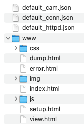
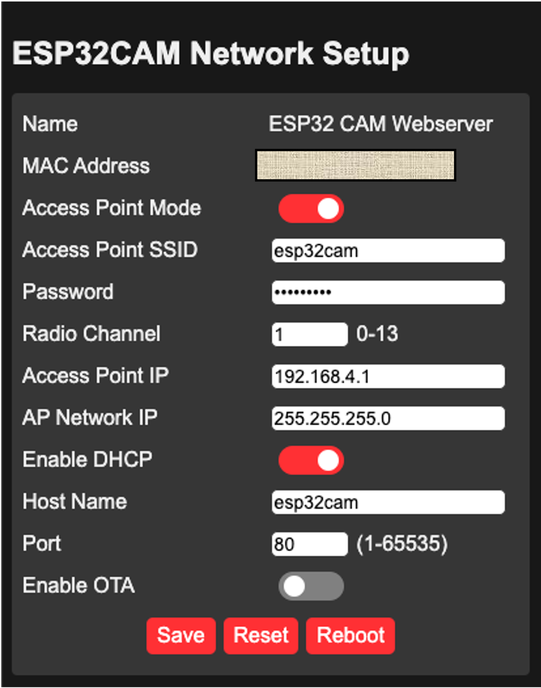
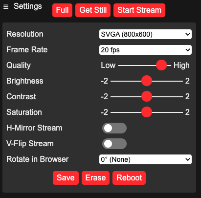

# ESP32-CAM WebServer. &nbsp;&nbsp;&nbsp; <span title="Master branch build status">[](https://travis-ci.com/github/easytarget/esp32-cam-webserver)</span> &nbsp;&nbsp; <span title="ESP EYE"></span>

This sketch is a fully customizable webcam server based on ESP32-based board with camera. 
It can be used as a starting point for your own webcam solution. 

There are many other variants of a webcam server for these modules online, 
but most are created for a specific scenario and not good for general, casual, 
webcam use.

### Key features: ###
* Extended options for default network and camera settings
* Configuration through the web browser, including intial WiFi setup
* Save and restore settings in JSON configuration files
* Dedicated standalone stream viewer
* Over The Air firmware updates
* Optimizing the way how the video stream is processed, thus allowing higher frame rates on high resolution.
* Using just one IP port, easy for proxying. 
* Porting the web server to [ESP Async Web Server](https://github.com/me-no-dev/ESPAsyncWebServer). 
* Storing web pages as separate HTML/CSS/JS files on the storage (can be either a micro SD flash memory card
or the built-in flash formatted as LittleFS).  This greatly simplifies development of the interface. Basically, one can swap the face of this project just by replacing files on storage file system. 
* Compact size of the sketch and low memory utilization

  
### Supported development boards ###
The sketch has been tested on the [AI Thinker ESP32-CAM](https://github.com/raphaelbs/esp32-cam-ai-thinker/blob/master/assets/ESP32-CAM_Product_Specification.pdf) 
module. Other ESP32 boards equipped with camera may be compatible but not guaranteed.

### Supported camera models:
The sketch has been tested on the following camera models:

* OV2640 (default)
* OV3660

Other camera models are not supported but may work with some limitations. 

### Known Issues

The ESP32 itself is susceptible to the usual list of WiFi problems, not helped by having 
small antennas, older designs, congested airwaves and demanding users. The majority of 
disconnects, stutters and other communication problems are simply due to 'WiFi issues'. 

The AI-THINKER camera module & esp32 combination is quite susceptible to power supply 
problems affecting both WiFi conctivity and Video quality; short cabling and decent 
power supplies are your friend here; also well cooled cases and, if you have the time, 
decoupling capacitors on the power lines.

A basic limitation of the sketch is that it can can only support one stream at a time. 
If you try to connect to a cam that is already streaming (or attempting to stream, 
the first steam will freeze. 

## Setup:

* For programming you will need a suitable development environment. Possible options
  include Visual Studio Code, Arduino Studio or Espressif development environment .

### Wiring for AI-THINKER Boards (and similar clone-alikes)

Is pretty simple, You just need jumper wires, no soldering really required, see the diagram below.


* Connect the **RX** line from the serisal adapter to the **TX** pin on ESP32
* The adapters **TX** line goes to the ESP32 **RX** pin
* The **GPIO0** pin of the ESP32 must be held LOW (to ground) when the unit is 
  powered up to allow it to enter it's programming mode. This can be done with simple 
  jumper cable connected at poweron, fitting a switch for this is useful if you 
  will be reprogramming a lot.
* You will to supply 5v to the ESP32 in order to power it during programming; the FTDI 
  board alone fails to supply this sometimes. The ESP32 CAM board is very sensitive 
  to the quality of power source. Decoupling capacitors are very much recommended.

### Download the Sketch, Unpack and compile
Download the latest release of the sketch this repository. Once you have done that you 
can open the sketch in the IDE by going to the `esp32-cam-webserver` sketch folder and 
selecting `esp32-cam-webserver.ino`. Compile it and upload to your board.

### Preparing the Web Server storage.
You will need to copy the content of the **data** folder from this repository to the storage, which 
can be either a micro SD flash memory card or the built-in flash memory with Little FS file system.

**IMPORTANT!** Without the storage and content of the data folder on it, the sketch will not start. 

#### Using micro SD flash memory card
You will need a blank SD card, which must be formatted as FAT32. Insert it into the micro SD slot of your computer and copy all the files from the **data** folder. The structure of files on the SD card should be 
like this: 


After that, insert the card in the slot of your ESP32CAM board and restart it. The Server should start normally.

Please ensure the size of the card does not exceed 4GB, which is a maximum supported capacity for ESP32-CAM board. Higher capacity SD card may not work.

#### Using built-in storage formatted as Little FS 
This option is still experimental and recommended for advanced users only. First, you will need to 
prepare your board and the dev environment for LittleFS. You can read about it [here:](https://github.com/lorol/LITTLEFS).

Next, you will need to prepare the sketch for work with LittleFS. For that, you will need to uncomment the 
following line in the `src/app_config.h`:

```
// #define USE_LittleFS
```

Re-build the sketch and upload it to the ESP32CAM board. Also upload the data folder using the 
**ESP32 Sketch Data Upload** tool, which is invoked from the `Tools` menu of Arduino IDE.

Provided that everything goes well, you shoudl be able to boot your ESP32 CAM Web Server from LittleFS.

### Initial configuration

If the system has not been configured yet, it will start in Access Point mode by default. The SSID
of the access point will be `esp32cam` and the password is `123456789`. if you have the Serial monitor
connected to the ESP32CAM board, you shoudl see the following messages:

```
No known networks found, entering AccessPoint fallback mode
Setting up Access Point (channel=1)
  SSID     : esp32cam
  Password : 123456789
IP address: 192.168.4.1
Access Point init successfull
Starting Captive Portal
OTA is disabled
mDNS responder started
Added HTTP service to MDNS server
Connected
```

Connected to the access point and open the url http://192.168.4.1/. You should see the following page: 


Switch the Access Point Mode off. The screen will change as follows: 


Specify SSID and Password for your WiFi setup. This board supports only 2.4 GHz band so you will need to ensure you wifi router has this band enabled.

Set up your preffered NTP server, Time Zone, Daylight Saving Time (DST), desired host name, HTTP port. 
If you plan to use Over-the-Air firmware update, please ensure to specify a complex password. Do not 
leave it empty or default.

Click `Save` and then `Reboot`. If everything is configured correctly, the ESP32CAM board will restart 
and connect to your wifi automatically. The assigned IP address can be seen in the Serial Monitor logs.

Open the browser and navigate to http://<YOUR_IP_ADDRESS:YOUR_PORT>/ (for example, http://192.168.0.2:8080)

You should see the following screen: 
. 

Here you can take still images or start the video streaming from the camera installed on ESP32CAM.

The WiFi configuration page is available at the address `http://<YOUR_IP_ADDRESS:YOUR_PORT>/setup`.

The system monitoring page is accessible at `http://<YOUR_IP_ADDRESS:YOUR_PORT>/dump`

### Configuration files

The web server stores its configuraion in JSON files. The format of the files is below. If any of these
files is missing in the root folder of the storage used, default values will be loaded.

#### Network Configuration (/conn.json)

```json
{   
    "mdns_name":"YOUR_MDNS_NAME",
    "stations":[
        {"ssid": "YOUR_SSID", "pass":"YOUR_WIFI_PASSWORD"}
    ],
    "dhcp": true,
    "static_ip": {"ip":"192.168.0.2", "netmask":"255.255.255.0", "gateway":"192.168.0.1", 
                  "dns1":"192.168.0.1", "dns2":"8.8.8.8"},
    "http_port":80,
    "ota_enabled":true,
    "ota_password":"YOUR_OTA_PASSWORD",
    "ap_ssid":"esp32cam",
    "ap_pass":"123456789",
    "ap_ip": {"ip":"192.168.4.1", "netmask":"255.255.255.0"},
    "ap_dhcp":true,
    "ntp_server":"pool.ntp.org",
    "gmt_offset":14400,
    "dst_offset":0,
    "debug_mode": false
}
```

#### HTTP server configuration (/httpd.json)

```json
{
    "my_name": "MY_NAME",
    "mapping":[ {"uri":"/dump", "path": "/www/dump.html"},
            {"uri":"/img", "path": "/www/img"},
            {"uri":"/css", "path": "/www/css"},
            {"uri":"/js", "path": "/www/js"}],
    "debug_mode": false
}
```

The parameter `mapping` allows to configure folders with static content for the web server. 

#### Camera Configuration (/cam.json):

```json
{   
    "lamp":-1,
    "autolamp":0,
    "framesize":8,
    "quality":12,
    "xclk":8,
    "frame_rate":25,
    "brightness":0,
    "contrast":0,
    "sharpness":0,
    "denoise":0,
    "saturation":0,
    "special_effect":0,
    "wb_mode":0,"awb":1,
    "awb_gain":1,
    "aec":1,
    "aec2":0,
    "ae_level":0,
    "aec_value":204,
    "agc":1,
    "agc_gain":0,
    "gainceiling":0,
    "bpc":0,
    "wpc":1,
    "raw_gma":1,
    "lenc":1,
    "vflip":0,
    "hmirror":0,
    "dcw":1,
    "colorbar":0,
    "rotate":"0", 
    "debug_mode": false
}
```

### Programming

Assuming you are using the latest Espressif Arduino core the `ESP32 Dev Module` board 
will appear in the ESP32 Arduino section of the boards list. Select this (do not use 
the `AI-THINKER` entry listed in the boiards menu, it is not OTA compatible, and will 
cause the module to crash and reboot rather than updating if you use it.


Make sure you select the `Minimal SPIFFS (1.9MB APP with OTA/190KB SPIFFS)` partition 
cheme and turn `PSRAM` on.

The first time you program (or if OTA is failing) you need to compile and upload the 
code from the IDE, and when the `Connecting...` appears in the console reboot the ESP32 
module while keeping **GPIO0** grounded. You can release GPO0 once the sketch is 
uploading, most boards have a 'boot' button to trigger a reboot.

Once the upload completes (be patient, it can be a bit slow) open the serial monitor 
in the IDE and reboot the board again without GPIO0 grounded. In the serial monitor 
you should see the board start, connect to the wifi and then report the IP address 
it has been assigned.

Once you have the initial upload done and the board is connected to the wifi network 
you should see it appearing in the `network ports` list of the IDE, and you can upload 
wirelessly.

If you have a status LED configured it will give a double flash when it begins 
attempting to conenct to WiFi, and five short flashes once it has succeeded. It will 
also flash briefly when you access the camera to change settings.


### API
The communications between the web browser and the camera module can also be used to 
send commands directly to the camera (eg to automate it, etc) and form, in effect, 
an API for the camera.
* [ESP32 Camera Web Server JSON API](API.md).

## Contributing

Contributions are welcome; please see the [Contribution guidelines](CONTRIBUTING.md).

## Future plans

1. Support of other boards and cameras.
2. Explore how to improve the video quality and further reduce requirements to resources.

